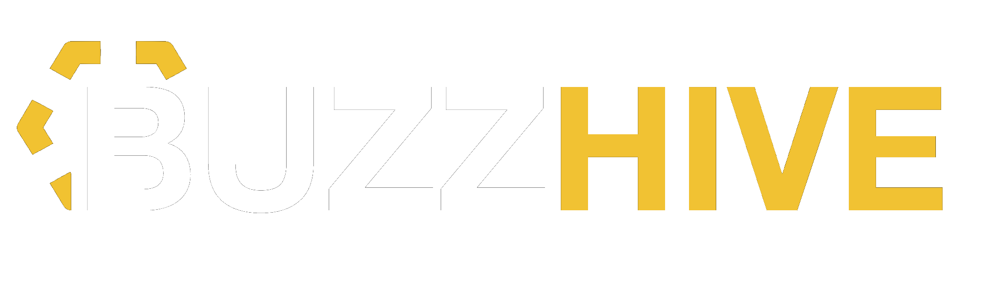

<p align="center">
  
</p>

<p align="center">
  <strong>Open-source smart beehive monitoring</strong><br>
  Temperature • Humidity • Weight • Audio AI
</p>

<p align="center">
  <a href="https://buzzhive.io">Website</a> •
  <a href="https://docs.buzzhive.io">Documentation</a> •
  <a href="https://discord.gg/buzzhive">Community</a> •
  <a href="https://buzzhive.io/shop">Shop</a>
</p>

<p align="center">
  <a href="LICENSE"></a>
  <a href="https://github.com/mbron64/buzzhive-open/releases"></a>
  <a href="https://discord.gg/buzzhive"></a>
</p>

<br>

<p align="center">
  
</p>

---

## Overview

Buzzhive helps beekeepers monitor their hives without constant inspections. Our sensors track temperature, humidity, weight, and even analyze audio to detect queen status — all synced to your phone.

**Why Buzzhive?**
- 🔓 **Fully open source** — firmware, hardware, everything
- 💰 **Affordable** — build your own or buy ready-made
- 🤖 **AI-powered** — audio analysis for queen detection
- 🔋 **Long battery life** — 12+ months on a single charge
- 📱 **Easy to use** — simple app, no technical knowledge needed

---

## Products

<table>
  <tr>
    <td align="center" width="33%">
      <br>
      <strong>Buzzhive Sense</strong><br>
      Temperature, humidity, audio<br>
      <a href="https://buzzhive.io/products/sense">Learn more →</a>
    </td>
    <td align="center" width="33%">
      <br>
      <strong>Buzzhive Scale</strong><br>
      Weight monitoring<br>
      <a href="https://buzzhive.io/products/scale">Learn more →</a>
    </td>
    <td align="center" width="33%">
      <br>
      <strong>Buzzhive Complete</strong><br>
      Everything in one<br>
      <a href="https://buzzhive.io/products/complete">Learn more →</a>
    </td>
  </tr>
</table>

Or [build your own](#build-your-own) using our open-source designs.

---

## How It Works

```
┌──────────────────┐          ┌──────────────────┐          ┌──────────────────┐
│                  │          │                  │          │                  │
│   Hive Sensor    │  ─────►  │    Your Phone    │  ─────►  │      Cloud       │
│                  │   BLE    │                  │   WiFi   │    (optional)    │
│  • Temperature   │          │  • View data     │          │  • History       │
│  • Humidity      │          │  • Get alerts    │          │  • Multi-hive    │
│  • Weight        │          │  • Log notes     │          │  • Sharing       │
│  • Audio         │          │                  │          │                  │
│                  │          │                  │          │                  │
└──────────────────┘          └──────────────────┘          └──────────────────┘
      In the hive                Weekly sync                   Optional
```

1. **Install** the sensor inside your hive
2. **Sync** data via Bluetooth when you visit
3. **Monitor** temperature, humidity, weight, and queen status
4. **Get alerts** when something needs attention

---

## Features

| Feature | Description |
|---------|-------------|
| 🌡️ **Temperature** | Track brood nest temperature (±0.5°C accuracy) |
| 💧 **Humidity** | Monitor moisture levels to prevent mold |
| ⚖️ **Weight** | See nectar flow and detect swarms instantly |
| 🎤 **Audio AI** | Analyze bee sounds to detect queen status |
| 📱 **Mobile App** | iOS and Android with simple, clean interface |
| 🔋 **Long Battery** | 12+ months on a single coin cell |
| 📡 **Flexible Connectivity** | Bluetooth, LoRa, or LTE options |
| 🔓 **Open Source** | Full access to firmware, hardware, and models |

---

## Quick Start

### Option 1: Buy a Kit

Get a pre-assembled, tested kit from our shop:

→ **[buzzhive.io/shop](https://buzzhive.io/shop)**

### Option 2: Build Your Own

Everything you need is in this repository.

#### Requirements

- ESP32-S3 development board
- I2S microphone (INMP441)
- Temperature/humidity sensor (SHT31)
- Load cells + HX711 (for weight)
- Battery + enclosure

#### Installation

```bash
# Clone the repository
git clone https://github.com/mbron64/buzzhive-open.git
cd buzzhive-open

# Flash the sensor firmware
cd firmware/esp32-hive-sensor
pio run --target upload

# Done! Pair with the mobile app to start monitoring.
```

See the [Build Guide](docs/build-guide.md) for detailed instructions.

---

## Mobile App

<p align="center">
  
</p>

- **iOS**: [Download on App Store](https://apps.apple.com/app/buzzhive)
- **Android**: [Download on Google Play](https://play.google.com/store/apps/details?id=io.buzzhive)
- **Source**: [mobile-app/](mobile-app/) (React Native)

---

## Documentation

| Guide | Description |
|-------|-------------|
| [Getting Started](docs/getting-started.md) | First-time setup |
| [Build Guide](docs/build-guide.md) | DIY hardware assembly |
| [Firmware Guide](docs/firmware-guide.md) | Flashing and configuration |
| [API Reference](docs/api-reference.md) | For developers |
| [FAQ](docs/faq.md) | Common questions |

---

## Repository Structure

```
buzzhive-open/
├── firmware/
│   ├── esp32-hive-sensor/     # Sensor firmware
│   └── esp32-base-station/    # Base station firmware (optional)
├── hardware/
│   ├── pcb/                   # KiCad PCB designs
│   └── enclosure/             # 3D printable cases
├── models/                    # Pre-trained ML models
├── mobile-app/               # React Native source
└── docs/                     # Documentation
```

---

## AI & Machine Learning

Buzzhive uses on-device machine learning to analyze bee sounds and detect queen status.

| Model | Accuracy | Size | Description |
|-------|----------|------|-------------|
| XGBoost | 78.8% | 50KB | Queen status classification |
| VAE | — | 1.8MB | Anomaly detection (experimental) |

The model runs entirely on the device — your audio never leaves the hive.

**Want to improve the model?** See [Training Guide](docs/training-guide.md) to contribute labeled data or train custom models.

---

## Contributing

We welcome contributions of all kinds:

- 🐛 Bug reports and fixes
- ✨ New features
- 📖 Documentation improvements
- 🌍 Translations
- 🧪 Testing with different bee species

See [CONTRIBUTING.md](CONTRIBUTING.md) to get started.

---

## Community

- **Discord**: [Join our community](https://discord.gg/buzzhive) for help and discussion
- **GitHub Discussions**: [Ask questions](https://github.com/mbron64/buzzhive-open/discussions)
- **Twitter**: [@buzzhive_io](https://twitter.com/buzzhive_io)

---

## License

This project is licensed under the [Apache License 2.0](LICENSE).

You are free to use, modify, and distribute this software. Attribution is appreciated but not required.

---

## Acknowledgments

- Audio analysis research based on [Chen et al. 2024](https://doi.org/10.1016/j.eswa.2024.124898)
- Thanks to all our [contributors](https://github.com/mbron64/buzzhive-open/graphs/contributors)
- Built with ❤️ for the beekeeping community

---

<p align="center">
  <a href="https://buzzhive.io">buzzhive.io</a> · 
  <a href="mailto:hello@buzzhive.io">hello@buzzhive.io</a>
</p>
